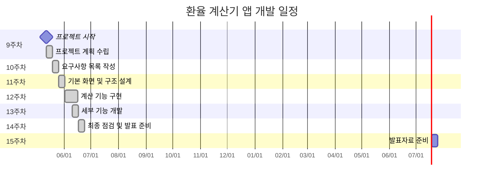

# 프로젝트 계획서
## 1. 프로젝트명  
**환율 계산기 앱 개발**
---
## 2. 프로젝트 개요  
본 프로젝트는 한국 수출입은행에서 제공하는 환율 정보를 활용하여 실시간 환율 계산 기능을 제공하는 모바일 애플리케이션을 개발하는 것을 목표로 한다. 사용자는 원하는 통화를 선택하고 금액을 입력하면, 선택한 통화에 대한 환산 금액을 확인할 수 있다.
---
## 3. 개발 목적  
- 실시간 환율 정보를 제공하여 사용자에게 편리한 환율 계산 기능을 제공  
- Flutter 및 Dart 언어에 대한 실습 및 앱 개발 능력 향상  
- 외부 API 연동 및 JSON 데이터 처리에 대한 이해도 증진
---
## 4. 주요 기능  
- 실시간 환율 정보 조회 (한국 수출입은행 API 활용)  
- 원하는 통화 선택 및 금액 입력  
- 환율 계산 결과 출력  
- 최근 환율 기준 날짜 표시  
- 간단한 사용자 인터페이스(UI)
- 특정 상품의 링크와 가격을 저장하고 날마다 환율에 맞게 확인하는 기능(개발 고민중)
---
## 5. 사용 기술  
- **개발 언어**: Dart  
- **프레임워크**: Flutter  
- **API**: 한국 수출입은행 환율 API  
- **개발 환경**: Android Studio, Flutter SDK
---
## 6. 핵심 기술
- **HTTP 통신**: API 호출을 위한 HTTP 패키지 활용
- **JSON 파싱**: 환율 데이터 처리를 위한 JSON 직렬화/역직렬화
- **상태 관리**: Provider 또는 setState를 통한 앱 상태 관리
- **비동기 처리**: Future와 async/await를 활용한 비동기 데이터 처리
- **로컬 스토리지**: SharedPreferences를 통한 사용자 설정 저장
- **UI/UX 디자인**: Material Design 기반 반응형 UI 구현
---
## 7. 기능별 요구사항 분석
### 7.1 사용자 요구사항
#### 7.1.1 기본 환율 계산 기능
| 순서 | 사용자 요구사항 | 세부 내용 |
|------|----------------|-----------|
| 1 | 통화 선택 기능 | 사용자는 기준 통화와 대상 통화를 직관적으로 선택할 수 있어야 함 |
| 2 | 실시간 환율 정보 | 최신 환율 정보가 자동으로 업데이트되어야 하며, 업데이트 시간이 표시되어야 함 |
| 3 | 간편한 금액 입력 | 숫자 키패드를 통해 쉽게 금액을 입력할 수 있어야 함 |
| 4 | 즉시 계산 결과 | 금액 입력 시 실시간으로 환율 계산 결과가 표시되어야 함 |
| 5 | 통화 교환 기능 | 원터치로 기준 통화와 대상 통화를 바꿀 수 있어야 함 |

#### 7.1.2 사용자 편의 기능
| 순서 | 사용자 요구사항 | 세부 내용 |
|------|----------------|-----------|
| 1 | 자주 사용하는 통화 | 주요 통화(USD, EUR, JPY, CNY 등)가 우선적으로 표시되어야 함 |
| 2 | 환율 변동 정보 | 전일 대비 환율 변동률이 색상으로 구분되어 표시되어야 함 |
| 3 | 계산 기록 관리 | 최근 계산한 환율 내역을 확인할 수 있어야 함 |
| 4 | 오프라인 사용 | 네트워크 연결이 없어도 마지막 환율 정보로 계산이 가능해야 함 |
| 5 | 직관적인 UI | 큰 글자와 버튼으로 가독성이 좋아야 하며, 한 손으로 조작 가능해야 함 |

#### 7.1.3 고급 사용자 요구사항
| 순서 | 사용자 요구사항 | 세부 내용 |
|------|----------------|-----------|
| 1 | 상품 가격 추적 | 특정 상품의 가격을 저장하고 환율 변동에 따른 실제 가격을 확인할 수 있어야 함 |
| 2 | 환율 알림 기능 | 목표 환율에 도달했을 때 알림을 받을 수 있어야 함 |
| 3 | 환율 차트 조회 | 일간, 주간, 월간 환율 추이를 그래프로 확인할 수 있어야 함 |
| 4 | 수수료 계산 | 실제 환전 시 발생하는 수수료를 포함한 계산이 가능해야 함 |

### 7.2 시스템 요구사항
#### 7.2.1 환율 정보 조회 기능
| 순서 | 요구사항 | 요구항목 | 요구내용 |
|------|----------|----------|----------|
| 1 | API 연동 | 실시간 데이터 | 한국 수출입은행 API 호출 |
| 2 | 데이터 파싱 | JSON 처리 | 환율 데이터 추출 및 변환 | 
| 3 | 오류 처리 | 네트워크 오류 | 연결 실패 시 사용자 알림 |
| 4 | 캐싱 처리 | 로컬 저장 | 마지막 환율 정보 저장 |

#### 7.2.2 환율 계산 기능
| 순서 | 요구사항 | 요구항목 | 요구내용 |
|------|----------|----------|----------|
| 1 | 입력 검증 | 숫자 유효성 | 올바른 금액 입력 확인 |
| 2 | 계산 로직 | 환율 연산 | 정확한 환율 계산 수행 |
| 3 | 결과 표시 | UI 업데이트 | 계산 결과 실시간 표시 |
| 4 | 소수점 처리 | 반올림 규칙 | 소수점 2자리까지 표시 |

#### 7.2.3 사용자 인터페이스
| 순서 | 요구사항 | 요구항목 | 요구내용 |
|------|----------|----------|----------|
| 1 | 직관적 설계 | 사용 편의성 | 간단하고 명확한 UI |
| 2 | 반응형 디자인 | 다양한 화면 크기 | 모든 기기에서 정상 동작 |
| 3 | 로딩 표시 | 사용자 피드백 | API 호출 중 로딩 스피너 |
| 4 | 접근성 | 사용자 친화적 | 큰 글자 및 고대비 모드 지원 |

#### 7.2.4 성능 및 보안 요구사항
| 순서 | 요구사항 | 요구항목 | 요구내용 |
|------|----------|----------|----------|
| 1 | 응답 속도 | 빠른 처리 | 앱 실행 후 3초 이내 사용 가능 |
| 2 | 메모리 관리 | 효율적 사용 | 메모리 누수 방지 |
| 3 | 데이터 보안 | 개인정보 보호 | 사용자 데이터 기기 내 저장 |
| 4 | API 보안 | 안전한 통신 | HTTPS 통신 및 API 키 보안 관리 |
---
## 8. 개발 일정 (간트차트)
### REV 1.0
| 주차   | 프로젝트 계획 수립 및 API 분석 | 프로젝트 세팅 및 UI 구성 | API 연동 및 데이터 처리 | 계산 기능 및 UI 연동 | 테스트 및 UI 개선 | 최종 점검 및 발표 |
|--------|------------------------------|----------------------------|-------------------------|----------------------|-------------------|-------------------|
| 9주차 [O] | ■■■■■                        |                            |                         |                      |                   |                   |
| 10주차 [X]|                              | ■■■■■                     |                         |                      |                   |                   |
| 11주차 [X]|                              |                            | ■■■■■                  |                      |                   |                   |
| 12주차 [X]|                              |                            |                         | ■■■■■              |                   |                   |
| 13주차 [X]|                              |                            |                         |                      | ■■■■■           |                   |
| 14주차 [X]|                              |                            |                         |                      |                   | ■■■■■            |
### REV 2.0
+ 계산기능 및 화면 구성은 개선이 필요해보여 지속적으로 수정 예정.
+ 실시간 OPEN API CORS문제 때문에 미완성으로 가는걸로 생각이 됨.
+ 생각보다 계산 기능이 오류가 좀 있어서 시간이 예상보다 좀 소요됨.

11주차 성과
화면 구성 dev 1.0

---
## 9. 기대 효과 
### (REV 1.0 기대효과)
- Flutter 기반 앱 개발 실무 능력 향상  
- REST API 연동 및 데이터 처리 경험 습득  
- 간단한 앱 배포 및 사용자 중심 설계 능력 강화
### 9.1 기술적 성과
- Flutter 기반 크로스플랫폼 앱 개발 역량 습득
- REST API 연동 및 JSON 데이터 처리 경험 축적
- 비동기 프로그래밍 및 상태 관리 이해도 향상
### 9.2 실무적 성과
- 실제 서비스 가능한 앱 개발 경험
- 사용자 중심 UI/UX 설계 능력 강화
- 프로젝트 계획 수립 및 일정 관리 경험
### 9.3 활용 가능성
- 포트폴리오 구성 요소로 활용
- 추가 기능 확장을 통한 상용 앱 개발 기반 마련
